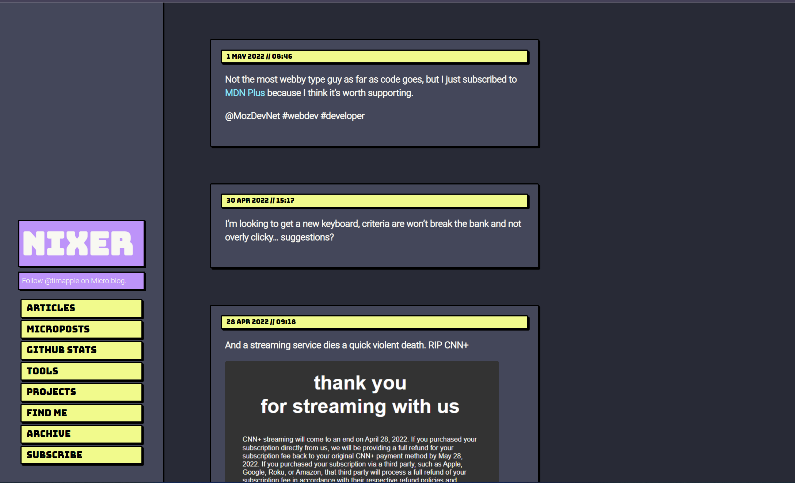

# Drapor

Drapor is a two-column theme for micro.blog sites using the [Dracula Theme colors](https://draculatheme.com) based on [Vapor1994](https://github.com/aezell/vapor1994) by Alex Ezell
## Screenshot

This is what Drapor looks like on [my blog](https://nixer.dev).

## License

Open sourced under the [MIT license](LICENSE.md) as licensed by Mark Otto.

<3
